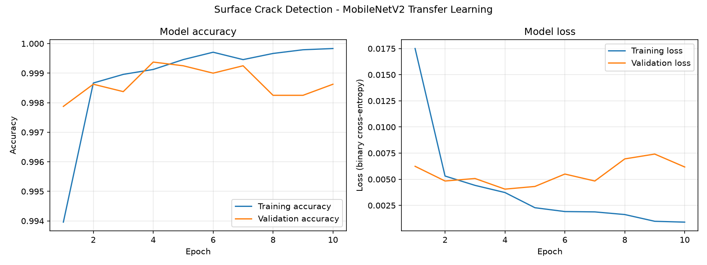
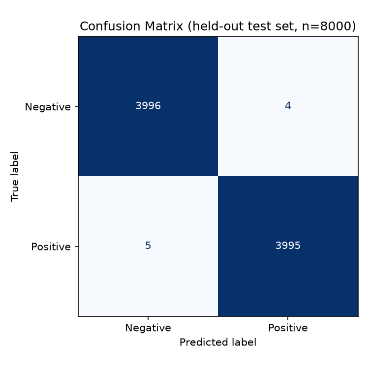
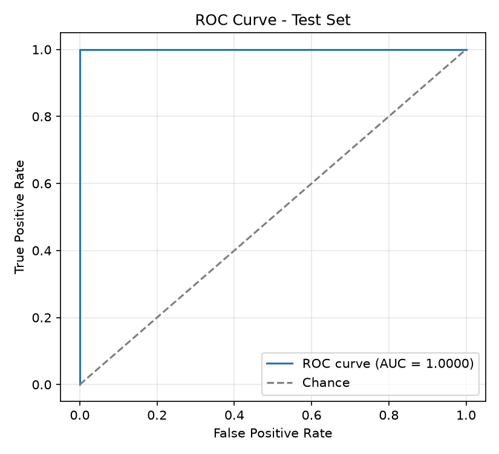
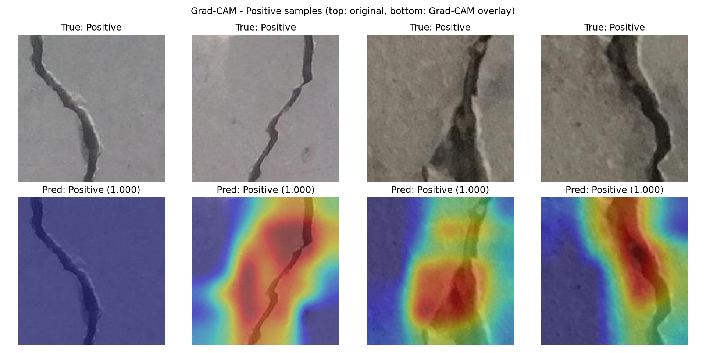

# Surface Crack Detection — CNN-based Image Recognition for Quality Inspection

A transfer-learning image classifier that detects surface cracks in
concrete/steel-type surfaces from high-resolution images, built as a
predictive-maintenance / automated quality-inspection tool for manufacturing
and infrastructure use cases (originally scoped as a "Tata Steel automated
crack inspection" problem statement).

> Given full end-to-end pipeline: data ingestion → preprocessing →
> MobileNetV2 transfer learning → training → evaluation → interpretability
> (Grad-CAM) → single-image inference.

## Results

Trained and evaluated on the full 40,000-image dataset (see [Dataset](#dataset)).

| Metric (held-out test set, n=8,000) | Value |
|---|---|
| Accuracy | **99.89%** |
| ROC-AUC | **0.99999** |
| Precision (Positive/Crack) | 99.90% |
| Recall (Positive/Crack) | 99.88% |
| Misclassified images | 9 / 8,000 |

Training converged in 10 epochs (early-stopped) on the classifier head.





### Interpretability (Grad-CAM)

Beyond a bare "Crack / No Crack" label, Grad-CAM is used to visualize which
pixels actually drove each prediction — important for trusting a model
before deploying it on a real inspection line.



For true crack images, the highlighted (red) region consistently sits
directly on top of the crack line itself, not on background texture —
evidence the model is learning the actual defect pattern rather than a
spurious shortcut.

## Problem Statement

Automate surface-crack inspection in manufacturing/infrastructure QA:
manual visual inspection is slow, inconsistent, and fatigue-prone. A
CNN-based image classifier can flag defective surfaces in real time,
enabling predictive maintenance and reducing downstream defects.

## Dataset

- **Source:** [Concrete Crack Images for Classification](https://data.mendeley.com/datasets/5y9wdsg2zt/2)
  (Özgenel, Ç.F., Mendeley Data, CC BY 4.0) — the same dataset referenced by
  the `arthurflor23/surface-crack-detection` GitHub repo used as the original
  data source for this project.
- 40,000 RGB images, 227×227px, generated from 458 high-resolution
  (4032×3024) images of concrete surfaces from METU campus buildings.
- **Balanced 2-class split:** 20,000 `Positive` (crack) / 20,000 `Negative`
  (no crack).
- Downloaded here via a parquet mirror on Hugging Face
  (`mohammadnajeeb/concrete_crack_images`) with a pre-defined
  **60/20/20 train/validation/test split** (24,000 / 8,000 / 8,000) — the
  test split is never touched during training or model selection, so the
  99.89% figure above is a genuinely held-out number.

Run `python src/download_data.py` to fetch the raw parquet files.

## Approach

### Why MobileNetV2 transfer learning?

Training a CNN from scratch needs millions of labeled images to learn
generic visual primitives (edges, textures, gradients). MobileNetV2
pretrained on ImageNet (1.4M images, 1000 classes) already knows those
primitives; freezing its convolutional base and only training a small
classification head on top lets a 40k-image dataset be enough to reach
near-ceiling accuracy, while needing a fraction of the compute of training
from scratch.

- `include_top=False` — drop the original ImageNet classification head.
- `weights='imagenet'` — start from pretrained weights.
- `trainable=False` — freeze the base; it acts as a fixed feature extractor.

### Architecture

```
Input (224×224×3)
   → MobileNetV2 base (frozen, ImageNet weights)   →  7×7×1280 feature map
   → GlobalAveragePooling2D                         →  1280-d vector
   → Dense(128, relu)
   → Dropout(0.3)
   → Dense(1, sigmoid)                              →  P(crack)
```

Compiled with Adam + binary cross-entropy, accuracy as the tracked metric.

**Deliberate change vs. the original design:** the original head used
`Flatten()` on the 7×7×1280 feature map, producing a 62,720-length vector
and an ~8M-parameter first dense layer — a large overfitting risk on a
binary problem, and almost certainly why that run was capped at 3 epochs.
Swapping in `GlobalAveragePooling2D()` (the pattern used in Keras's own
transfer-learning tutorials) collapses that to a 1280-length vector, cutting
the first dense layer to ~164k parameters (~98% fewer) with no loss of
per-channel information, which lets the head train longer and more stably.

### Training efficiency trick: bottleneck feature caching

Because the MobileNetV2 base is frozen, its output for a given image is
identical on every epoch. Instead of re-running that same forward pass
40,000 times *per epoch*, `feature_extraction.py` runs it **once** per image
and caches the resulting 1280-d feature vector to disk (`features/*.npz`).
`train.py` then trains only the lightweight head on these cached vectors,
which finishes in seconds per epoch on a laptop CPU — no GPU required for
this stage. The final saved model (`models/surface_crack_mobilenetv2.keras`)
re-assembles the frozen base + trained head into one end-to-end
image-in/prediction-out artifact for inference, Grad-CAM, and deployment.

### Preprocessing

- Resize to 224×224 (standard CNN/MobileNetV2 input size).
- `mobilenet_v2.preprocess_input` normalization (scales to [-1, 1] the way
  the pretrained weights expect).
- Stratified train/val/test split provided by the dataset (60/20/20).

## Project structure

```
SurfaceCrackDetection/
├── src/
│   ├── config.py              # paths, constants, hyperparameters
│   ├── download_data.py       # fetch the dataset (parquet)
│   ├── feature_extraction.py  # decode images -> cached MobileNetV2 features
│   ├── model.py                # head + full end-to-end model definitions
│   ├── train.py                # train head, save model + training curves
│   ├── evaluate.py             # test-set metrics, confusion matrix, ROC
│   ├── gradcam.py              # Grad-CAM interpretability visualizations
│   └── predict.py              # single-image CLI inference
├── data/samples/               # small set of real sample images (for demo)
├── outputs/                    # generated plots + metrics (checked in)
├── features/                   # cached bottleneck features (regenerated)
├── models/                     # saved .keras models (regenerated)
└── requirements.txt
```

## Reproducing this end-to-end

```bash
python -m venv venv && source venv/bin/activate
pip install -r requirements.txt

cd src
python download_data.py       # ~230MB download
python feature_extraction.py  # ~4-5 min on CPU, caches features + sample images
python train.py                # trains head, saves training_curves.png
python evaluate.py             # test metrics, confusion_matrix.png, roc_curve.png
python gradcam.py              # Grad-CAM overlays
python predict.py ../data/samples/Positive/test_0.jpg
```

## Applications

- Automated defect inspection on production/inspection lines.
- Real-time rejection sorting on robotic arms / conveyor systems.
- Predictive-maintenance alerts before cracks propagate further.
- Extendable to other materials (glass, ceramics, asphalt, other metals)
  given a suitably labeled dataset.

## Future scope

- Move from classification to detection/localization (YOLOv8, Faster R-CNN)
  to draw a bounding box/segment around the crack, not just flag the image.
- Fine-tune the last few MobileNetV2 blocks (instead of full freeze) once
  more labeled data is available, to adapt features further to this domain.
- Package as a lightweight on-device/edge app (MobileNetV2 is small enough
  for this) for real-time inspection without a network round-trip.
- Extend labels beyond binary crack/no-crack to defect *type* and severity.

## Acknowledgements

Dataset: Özgenel, Ç.F. (2019), "Concrete Crack Images for Classification",
Mendeley Data, v2, DOI: 10.17632/5y9wdsg2zt.2. Also see: Özgenel, Ç.F.,
Gönenç Sorguç, A. "Performance Comparison of Pretrained Convolutional Neural
Networks on Crack Detection in Buildings", ISARC 2018.
